# How strata refreshes by itself

With `auto_refresh = true` in the config file, strata reads the branches again when git changes a branch, the
trunk or a checkout. A file watch tells strata that git wrote a file that holds refs. A poll catches the
changes that the watch does not see. strata then compares the refs with the refs of the tree on the screen,
and reads the tree again only when they changed.

This page tells how each part works. It uses the terms of [docs/stack.md](stack.md): trunk, parent, base and
tip.

## Terms

| Term | Meaning |
| --- | --- |
| refs | The branches that strata reads and the trunk, each with the commit that it points at. |
| refs text | The text that `Reader.Refs` returns. It changes when a ref moves or a worktree checks out a different branch. |
| common git folder | The `.git` folder that all worktrees of a repository share. `git rev-parse --git-common-dir` prints it. |
| check | Read the refs text and compare it with the refs text of the tree on the screen. |
| refresh | Read the tree again and show it. `r` starts a refresh. A check starts one when the refs text changed. |
| watch | The fsnotify watcher on the folders of the common git folder that hold refs. |
| event | A message from fsnotify that a file or a folder changed. |
| quiet time | 200 ms with no event. The watch calls a check at the end of the quiet time. |
| backup poll | A check each 30 s while the watch runs. |
| fast poll | A check each 2 s. strata uses it when the watch cannot run. |
| busy | A move or a delete runs, the sync plan is open, or a delete waits for `y`. |

## When strata refreshes by itself

| `auto_refresh` | `--remote` | What strata does |
| --- | --- | --- |
| `false`, or not in the config file | any | No watch and no poll. A read of the branches runs no command for the refs text. `r` refreshes. |
| `true` | not set | The watch and the backup poll, or the fast poll when the watch cannot run. `r` refreshes. |
| `true` | set | No watch and no poll. `r` refreshes. |

With `--remote`, strata reads all the branches of the remote. On a repository with 558 remote branches, that
read takes 17 to 24 s, so strata does not start it by itself.

## Parts

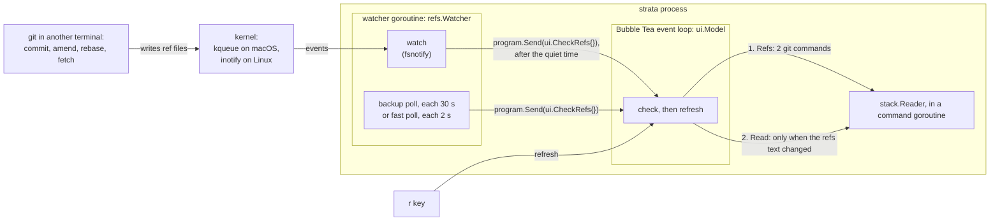

| Part | File | Job |
| --- | --- | --- |
| `config.Config.AutoRefresh` | `internal/config/config.go` | The value of `auto_refresh`. It is `false` by default. |
| `autoRefreshOf` | `cmd/strata/main.go` | Tells whether the automatic refresh runs: `auto_refresh` is on and `--remote` is not set. |
| `Reader.Refs` | `internal/stack/reader.go` | Returns the refs text. |
| `Reader.WithRefs` | `internal/stack/reader.go` | Returns a reader whose `Read` also fills `Tree.Refs`. |
| `refs.Watcher` | `internal/refs/watcher.go` | Runs the watch and the polls. Calls a function for each check. |
| `ui.CheckRefs` | `internal/ui/model.go` | The message that starts a check. |
| `branchKey`, `fileKey` | `internal/ui/cache.go` | The cache keys. They let a refresh keep what did not change. |

`main.go` connects the parts:

```go
program := tea.NewProgram(model, tea.WithContext(ctx), tea.WithColorProfile(colorProfile()))
if autoRefresh {
	watchCtx, stopWatch := context.WithCancel(ctx)
	defer stopWatch()
	go refs.NewWatcher(repo).Run(watchCtx, func() { program.Send(ui.CheckRefs{}) })
}
_, err = program.Run()
```

`program.Send` waits until the event loop takes the message. It returns at once after the program stops,
because Bubble Tea cancels its context at the end of `Run`.

## From a commit to the screen

This is an amend in another terminal:

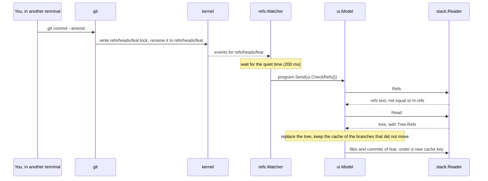

## The refs text

`Reader.Refs` runs 2 git commands:

```sh
git for-each-ref --format='%(objectname)%00%(worktreepath)%00%(refname)' <patterns>
git rev-parse --verify <trunk>
```

`<patterns>` are the patterns that strata reads the branches with, `refs/heads/` by default. The text holds
the commit and the worktree of each ref, and the commit of the trunk.

| After | The refs text |
| --- | --- |
| A commit, an amend, a squash, a reset, or a rebase that moves a branch | changes |
| A new branch, or a deleted branch | changes |
| A fetch that moves the trunk | changes |
| Another worktree checks out a branch, or leaves it | changes |
| The worktree of strata checks out a different branch | changes, because the worktree of both branches changes |
| `git gc` or `git pack-refs` | stays the same: the refs move into `packed-refs`, but each ref keeps its commit |
| `git status`, or a change to a file in a worktree | stays the same |

### The first tree

`main.go` reads the first tree before the screen starts. With the automatic refresh on, it uses the reader
from `WithRefs`. `Read` of that reader calls `Refs` before it reads the tree, and puts the text in
`Tree.Refs`. The model takes its `refs` from that tree.

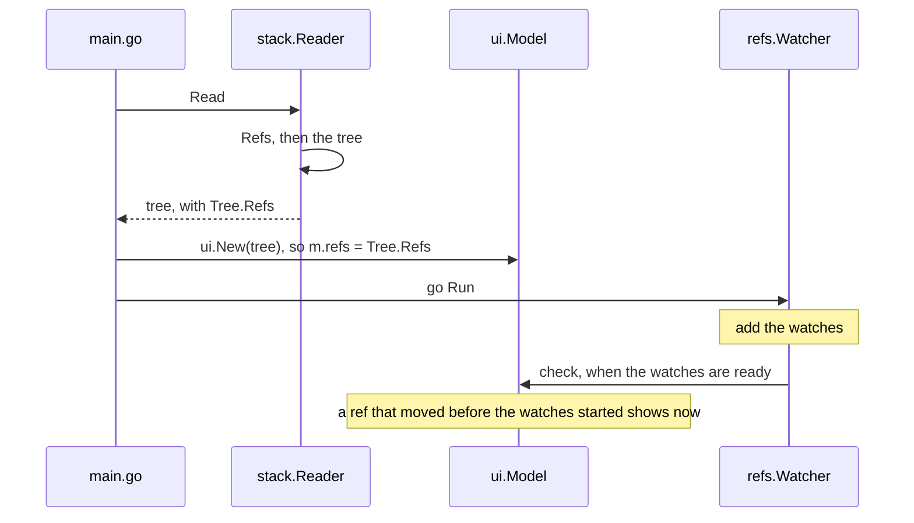

Two gaps can hide a change, and each has a guard:

- **A ref moves while `Read` reads the tree:** `Refs` ran before the tree, so the next check gets a
  different refs text and refreshes.
- **A ref moves after `Read` and before the watches start:** no event comes for that change. The watcher
  calls one check when its watches are ready.

`r`, and the read after a delete, use the same reader. So they also set `m.refs`, and the next check does not
refresh again.

## The check in the model

The model keeps three fields for the check:

| Field | Meaning |
| --- | --- |
| `refs` | The refs text of the tree on the screen. |
| `checking` | A check runs. |
| `wantCheck` | A check waits. It starts when no check runs and strata is not busy. |

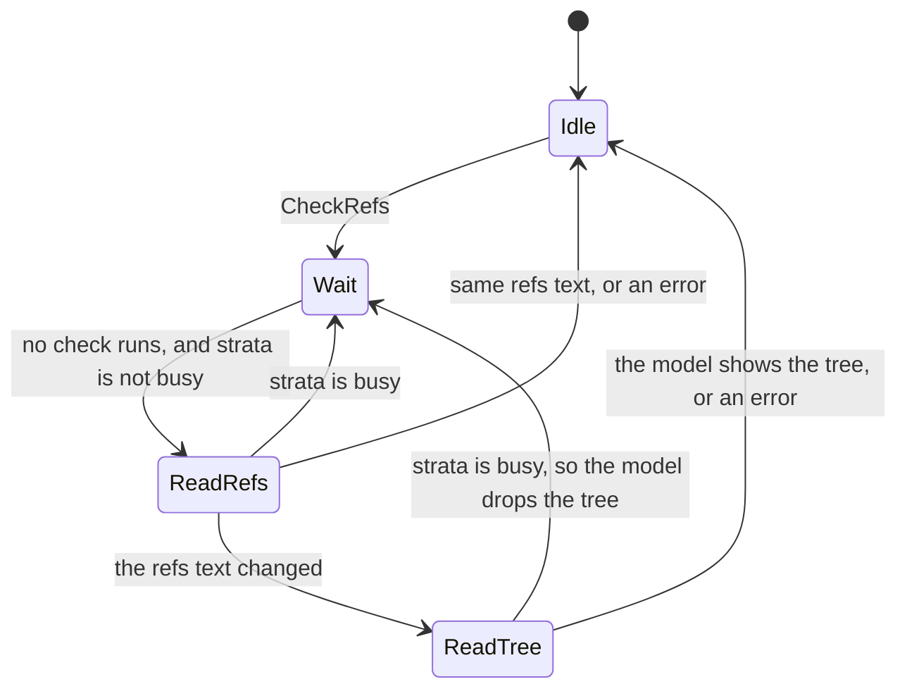

A `CheckRefs` that arrives while a check runs sets `wantCheck` too, so one more check starts after that check
ends.

| Message | The model does |
| --- | --- |
| `CheckRefs` | Sets `wantCheck`. |
| `refsRead` | Stops when `Refs` failed or the text is equal to `m.refs`. When strata is busy, it sets `wantCheck` again. Otherwise it runs `Read` in a command. |
| `treeChanged` | Drops the tree when `Read` failed. When strata is busy, it drops the tree and sets `wantCheck` again. Otherwise it sets `m.refs`, replaces the tree and loads what the new tree needs. |

After each message, `Update` looks at `wantCheck`. When a check waits, no check runs and strata is not busy,
`Update` clears `wantCheck`, sets `checking`, and runs `Refs` in a command. So a check starts in one place
only.

These rules apply:

- **Busy:** a new tree replaces the tree of the Stack panel. That closes the sync plan and cancels a delete
  that waits for `y`. So a check waits while strata is busy, and starts when the sync plan closes, the delete
  ends, or the move ends.
- **Errors:** a check that fails shows no error. The next check tries again. `r` shows the error.
- **Messages:** a refresh from a check keeps the status line and the footer notice, for example
  `Deleted billing (was 1a2b3c4).`
- **Results out of order:** `m.refs` always comes from the tree on the screen. When an old read arrives after
  a new read, the next check gets a different refs text and refreshes again.
- **One check at a time:** a check that arrives while another check runs waits for it. Many checks that
  arrive in that time start one check.

## What a refresh keeps

The cache of the screen holds the file list, the commit list and the diffs of each branch that strata
loaded. The cache keys decide what a refresh keeps:

```go
func branchKey(b stack.Branch) string {        // file list and commit list
	return b.Base + ".." + b.Name + "@" + b.Tip
}

func fileKey(b stack.Branch, f diff.File) string {   // one diff
	return b.Base + ".." + b.Name + "\x00" + f.OldBlob + "\x00" + f.NewBlob + "\x00" + f.Path
}
```

| After a refresh | Result |
| --- | --- |
| A branch did not move | Its key stays. Its file list and its viewed count stay on the screen. |
| A branch moved | Its tip changes, so its key changes. strata loads its files and commits again. The Files panel keeps the selected path. |
| A file did not change | Its blobs stay, so its key stays. The diff keeps its scroll position, also when its branch moved. |
| A file changed | Its blobs change, so its key changes. The diff loads again from the top. |

While the new file list of a moved branch loads, the Diff panel keeps the key of the diff on the screen. When
the same file shows again, its key did not change, so the scroll position stays.

`r` and a check keep different parts of the cache:

| Cache entry | After `r` | After a check that refreshes |
| --- | --- | --- |
| File lists and diffs of branches that did not move | stay | stay |
| Commit lists | load again, so their ages change | stay |
| A file list or a diff whose load failed | loads again | stays |
| Entries of a branch that moved | load again under the new key | load again under the new key |

The entries of old keys stay in memory until the sync plan opens or strata stops. There is one entry for each
change, and diffs only for the files that you opened.

## The watch

### Folders

The watcher runs `git rev-parse --path-format=absolute --git-common-dir`, and watches these folders in the
common git folder:

```
.git/                          watched: events on HEAD and packed-refs
├── HEAD
├── packed-refs
├── index                      no check
├── objects/                   not watched
├── logs/                      not watched
├── refs/                      watched, with each folder at each level
│   ├── heads/
│   │   ├── main
│   │   └── team/
│   │       └── billing
│   └── remotes/
│       └── origin/
│           └── main
├── reftable/                  watched: events on tables.list
└── worktrees/                 watched: new and removed folders
    └── billing/               watched: events on HEAD
        ├── HEAD
        └── reftable/          watched: events on tables.list
```

| Folder | Ref format | Events that start the quiet time |
| --- | --- | --- |
| `.git` | both | `HEAD`, `packed-refs` |
| `.git/refs`, and each folder under it | `files` | each name that does not end in `.lock`, and each new folder |
| `.git/reftable` | `reftable` | `tables.list` |
| `.git/worktrees` | both | each new or removed folder |
| `.git/worktrees/<name>` | `files` | `HEAD` |
| `.git/worktrees/<name>/reftable` | `reftable` | `tables.list` |

The watcher adds the folders of both ref formats. A folder that does not exist gets no watch, so the watcher
does not ask git for the ref format. `watched` and `holdsRefs` in `internal/refs/watcher.go` hold these rules.

### Events

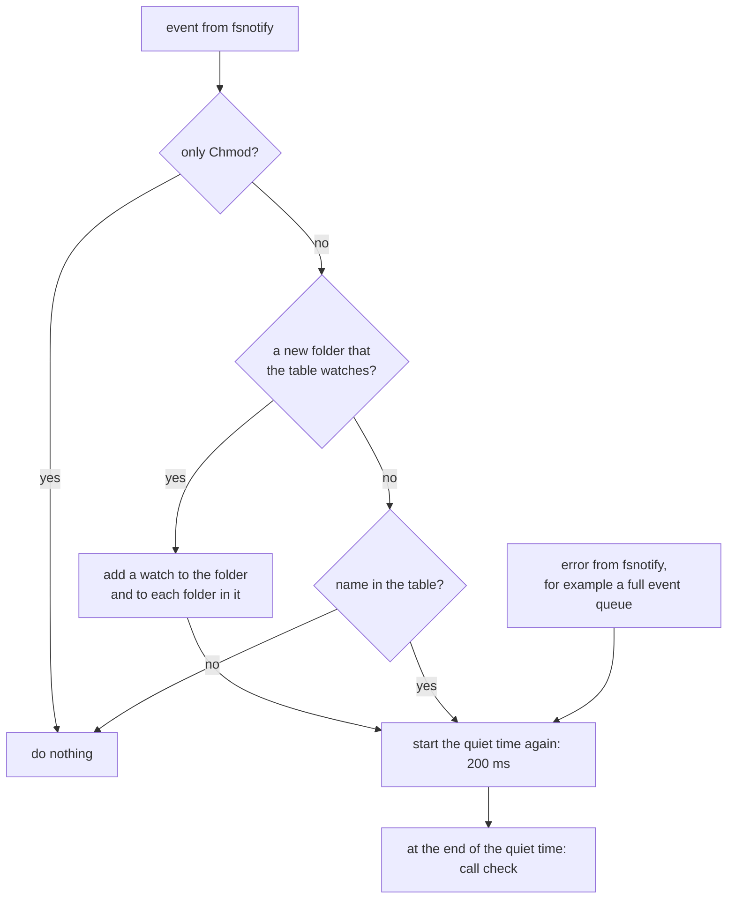

- **`.lock` names:** git writes a ref to `<name>.lock` and then renames it to `<name>`. The rename gives an
  event for `<name>`, so an event for the lock file adds nothing.
- **New folders:** git can make a folder and write a ref into it before the watch on that folder starts. So a
  new folder starts the quiet time too. The check reads the refs, not the events, and finds that ref.
- **`Chmod`:** the fsnotify README says that Spotlight on macOS gives many `Chmod` events. `git status` in a
  reftable repository gave `Chmod` events on the `.ref` files too. These events change no ref.
- **Errors:** an error from fsnotify, such as a full event queue on Linux, can mean that an event was lost.
  So it starts the quiet time.

### Quiet time

One git command writes many files. A rebase of 3 commits gave 156 events on macOS, in less than 60 ms. Each
event starts the quiet time again, so the check starts once, after the last event:

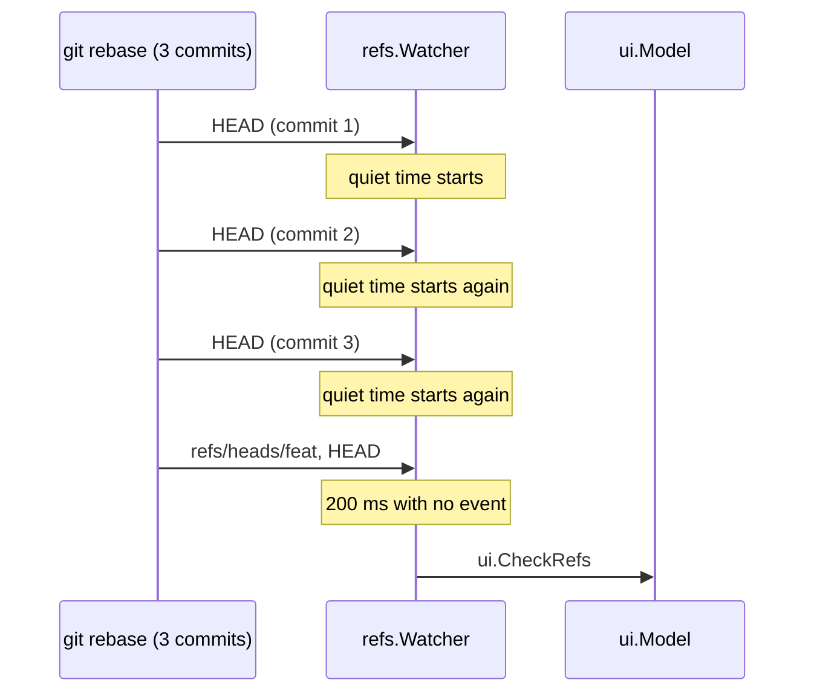

A command with a longer gap between its writes, for example a rebase that runs hooks, can give more than one
check. Each check costs 2 git commands, and the model refreshes only when the refs text changed.

### Removed folders

`git pack-refs`, which `git gc` runs, moves the refs into `packed-refs` and removes the folders under `refs`
that it leaves empty. The watch on a removed folder stops. When git makes the folder again, the event on its
parent folder adds the watch again. This is a branch `team/billing`:

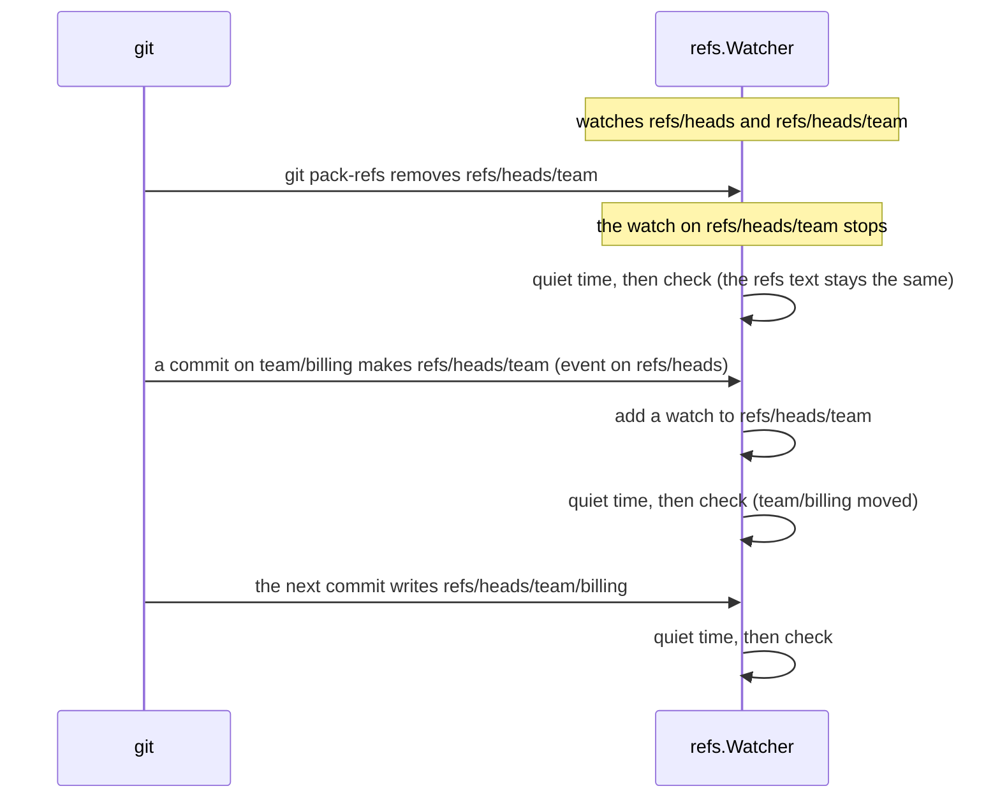

git never removes `.git/refs`, because git needs that folder to find the repository.

### Polls

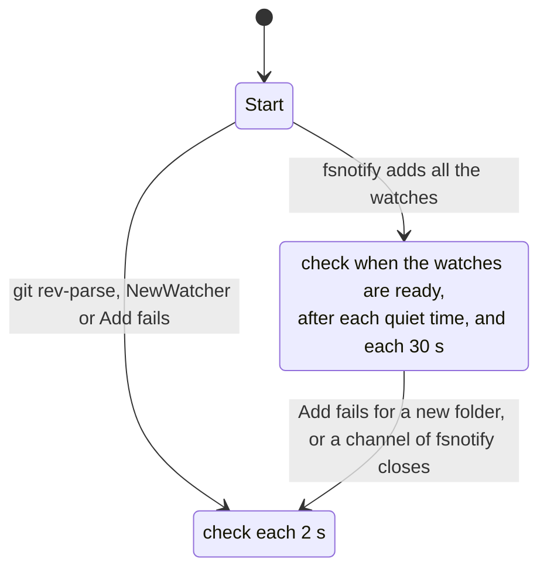

- **Backup poll:** the watch can start and then get no events, for example when `.git` is on a network
  filesystem or on some container mounts. strata cannot see this case. The backup poll shows the change in
  30 s or less.
- **Fast poll:** the watch cannot start when the process has no more open files, when Linux has no more
  inotify instances, or when strata cannot read a folder under `refs`. The watcher then stops the watch and
  checks each 2 s until strata stops.

## How fsnotify works

fsnotify gives one Go API on each operating system:

- `fsnotify.NewWatcher()` makes a watcher.
- `Add(path)` watches one file or one folder. For a folder, it gives events for the files in the folder.
- `Events` is a channel of `Event{Name, Op}`. `Op` is `Create`, `Write`, `Remove`, `Rename` or `Chmod`.
- `Errors` is a channel of errors, for example `ErrEventOverflow`.

`Add` does not watch the folders in a folder. fsnotify v1.9.0 has code for recursive watches on Linux, but
it turns that code on only in its own tests. So the watcher adds each folder under `refs` itself.

Under the API, each operating system has a different kernel interface. strata has releases for macOS and
Linux.

### macOS: kqueue

kqueue tells a process when an open file changes. It does not watch a path, and its event for a folder does
not name the file in the folder that changed.

1. `kqueue()` makes one kernel queue.
2. For each watched path, fsnotify opens the path with `O_EVTONLY`. This flag opens the file for events only,
   so macOS can still unmount the volume.
3. fsnotify registers the open file with `kevent`, filter `EVFILT_VNODE`, flag `EV_CLEAR`, and the notes
   `NOTE_DELETE`, `NOTE_WRITE`, `NOTE_ATTRIB` and `NOTE_RENAME`.
4. For a watched folder, fsnotify also opens each file in the folder. This gives `Write` and `Remove` events
   for those files.
5. When the entries of a folder change, the kernel sends `NOTE_WRITE` for the folder. fsnotify reads the
   folder with `ReadDir` and compares the names with the names it knows. It sends `Create` for each new name
   and opens that file too.
6. `EV_CLEAR` makes the kernel merge the changes to one file until fsnotify reads them. No change is lost,
   but more than one change can give one event.

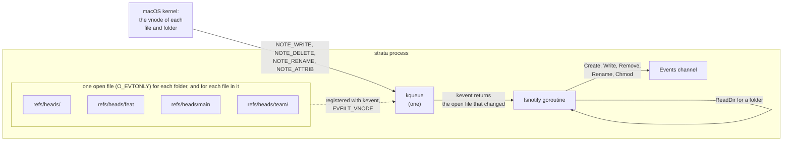

This is how one ref update arrives on macOS:

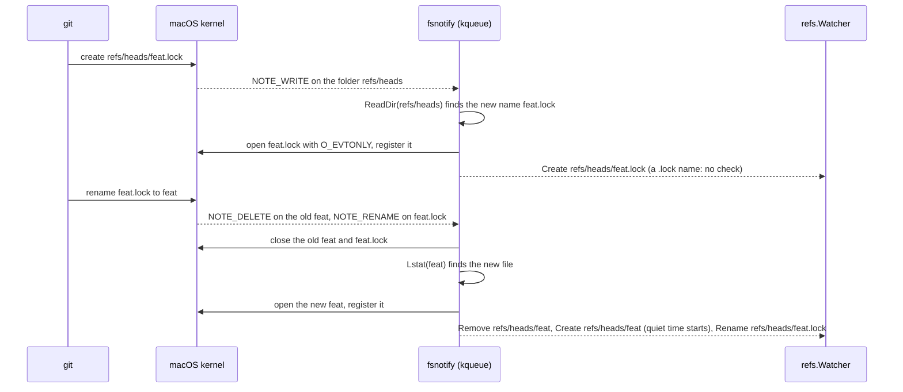

When git renames the lock file before fsnotify reads the folder, the `Create` event for the lock file does not
come. The events for `refs/heads/feat` still come.

The cost is one open file for each watched folder and for each file in a watched folder:

| Folders watched | Open files, with the watch | Open files, with no watch |
| --- | --- | --- |
| 88 | 305 | 10 |
| 17 | 112 | 10 |
| 7 | 47 | 10 |

The limit on a Mac is `kern.maxfilesperproc`, for example 61,440 open files. Go raises the soft limit of
open files to the hard limit when the process starts.

macOS also has FSEvents, which watches a folder and all its folders with no open file for each file. strata
does not use it: FSEvents needs cgo, the release builds use `CGO_ENABLED=0`, and fsnotify has no FSEvents
backend.

### Linux: inotify

inotify watches a path, and each event names the file in the folder that changed.

1. `inotify_init1()` makes one inotify file for all the watches.
2. `inotify_add_watch(fd, path, mask)` adds a watch and returns a watch number. A watch is kernel memory, not
   an open file.
3. fsnotify asks for `IN_CREATE`, `IN_MODIFY`, `IN_DELETE`, `IN_DELETE_SELF`, `IN_MOVED_FROM`, `IN_MOVED_TO`,
   `IN_MOVE_SELF` and `IN_ATTRIB`.
4. The kernel puts each event in a queue. The event holds the watch number, the mask, and the name of the file
   in the folder.
5. A rename gives `IN_MOVED_FROM` with the old name and `IN_MOVED_TO` with the new name. fsnotify sends
   `Rename` for the old name and `Create` for the new name.
6. When a watched folder goes away, the kernel sends `IN_DELETE_SELF` and `IN_IGNORED`, and removes the watch.
7. When the queue is full, the kernel sends `IN_Q_OVERFLOW`. fsnotify sends `ErrEventOverflow` on `Errors`,
   and the watcher starts the quiet time.

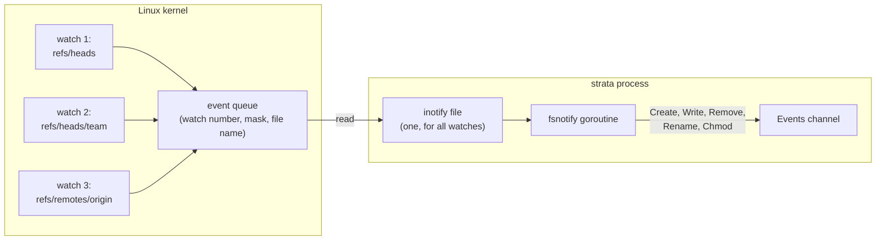

This is the same ref update on Linux:

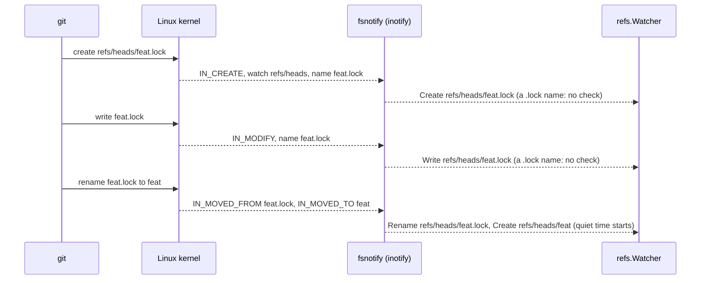

The cost does not grow with the count of folders. A process with 20 watches, and a process with all the
folders under `refs` of a large repository, each had 7 open files. The limits are:

| Setting | Example value | What it limits |
| --- | --- | --- |
| `fs.inotify.max_user_watches` | 1,048,576 | Watches for each user, for all programs. |
| `fs.inotify.max_user_instances` | 128 | inotify files for each user. Each strata uses one. |
| `fs.inotify.max_queued_events` | 16,384 | Events in the queue of one inotify file. |

### Side by side

| | kqueue (macOS) | inotify (Linux) |
| --- | --- | --- |
| Kernel object | One kqueue | One inotify file |
| Cost of a watch on a folder | One open file for the folder, and one for each file in it | One watch number, no open file |
| The event names the changed file | No. fsnotify reads the folder again. | Yes |
| Folders in a watched folder | The watcher adds them | The watcher adds them |
| A file that a rename replaces | `Remove` and `Create` | `Create` |
| A watched folder that goes away | `NOTE_DELETE`. fsnotify removes the watch. | `IN_DELETE_SELF` and `IN_IGNORED`. The kernel removes the watch. |
| Too many events | The kernel merges the changes to one file | `IN_Q_OVERFLOW`, then `ErrEventOverflow` |

## What git writes

A script ran git operations in a repository with a remote and a worktree, and watched all the folders of
`.git` except `objects`. The table counts all events, and the events on `refs/`, `HEAD` or `packed-refs`
whose names do not end in `.lock`.

| Operation | macOS: all | macOS: refs | Linux: all | Linux: refs | Did the refs text change? |
| --- | --- | --- | --- | --- | --- |
| `git status` | 8 | 0 | 4 | 0 | no |
| commit | 23 | 2 | 22 | 1 | yes |
| amend | 14 | 2 | 16 | 1 | yes |
| squash (`reset --soft`, then commit) | 26 | 4 | 36 | 2 | yes |
| commit in another worktree | 26 | 2 | 22 | 1 | yes |
| new branch | 5 | 1 | 6 | 1 | yes |
| delete branch | 8 | 1 | 13 | 1 | yes |
| checkout in this worktree | 28 | 4 | 34 | 2 | yes |
| fetch that moves the trunk | 8 | 2 | 7 | 1 | yes |
| rebase of 3 commits | 156 | 12 | 239 | 6 | yes, one ref move at the end |
| fetch with nothing new | 3 | 0 | 2 | 0 | no |
| `git pack-refs` | 17 | 7 | 20 | 7 | no |
| `git gc` | 39 | 5 | 54 | 4 | no |

These results give the design of the watch:

- **Each change to the refs text gave at least one event on refs.** A watch on the folders in
  [Folders](#folders) is enough.
- **Most events are not about refs.** `git status` rewrites `index` in the same folder as `HEAD`. A shell
  prompt that runs `git status` gives these events often. So the watcher looks at the name.
- **An event on refs does not always change a ref.** `git pack-refs` and `git gc` give events on refs, but no
  ref moves. So a check compares the refs text, and strata refreshes only when the text changed.
- **One operation gives many events.** The quiet time turns them into one check.

## Cost

These numbers come from a Mac, on a repository with 18 local branches, 558 remote branches and 420 MB of
objects.

| | Cost |
| --- | --- |
| A check | 2 git commands, 20 to 45 ms, mostly the start of the processes |
| A refresh | A read of the stack, 240 to 380 ms on repositories with 6 and 18 local branches |
| git commands while nothing changes | 2 each 30 s with the watch, 2 each 2 s with the fast poll |
| Open files for the watch | 305 on macOS for this repository, 1 inotify file on Linux |
| `auto_refresh` off | nothing: no watch, no poll, and no command for the refs text |

## Limits

- **A rebase that starts:** it moves no ref, so strata shows `rebase in <folder>` after the next change to the
  refs text, or after `r`.
- **Uncommitted files:** strata does not show them, so a change to them starts no refresh.
- **Filesystems that send no events:** the backup poll shows the change in 30 s or less.
- **Old cache entries:** they stay in memory until the sync plan opens or strata stops.
- **`--remote`:** strata does not refresh by itself. Press `r`.

## Tests

| Test | File | What it checks |
| --- | --- | --- |
| `TestModel`, group `refresh` | `internal/ui/model_test.go` | What `r` and a check keep and load again, and that a check waits while strata is busy. |
| `TestReader`, group `refs` | `internal/stack/reader_test.go` | When the refs text changes and when it stays the same, with real git. |
| `TestWatcher` | `internal/refs/watcher_test.go` | The check after a commit, a new folder, a removed folder and a worktree change; one check for close events; no check after `git status`; the fast poll. |
| `TestCommand`, group `auto refresh` | `cmd/strata/main_test.go` | The option, and `--remote`. |
| `the config file` | `e2e/tests/config.test.ts` | A commit shows with no key press when the option is on, and only after `r` when it is off. |
