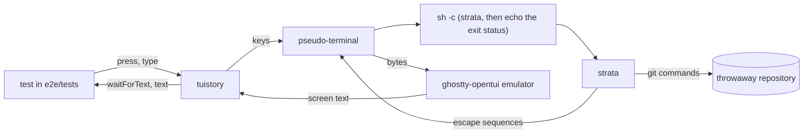
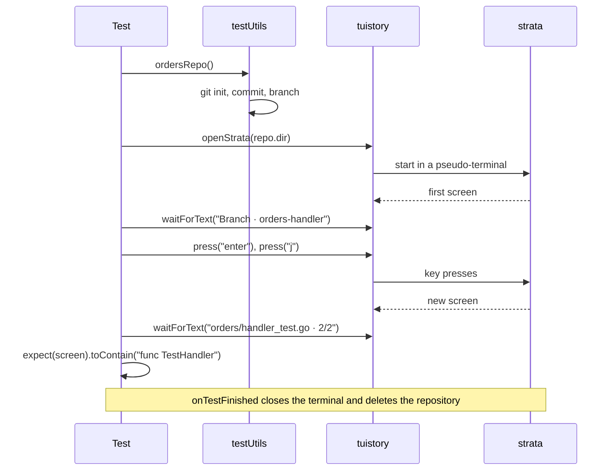
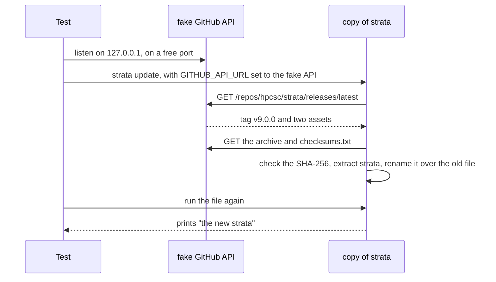
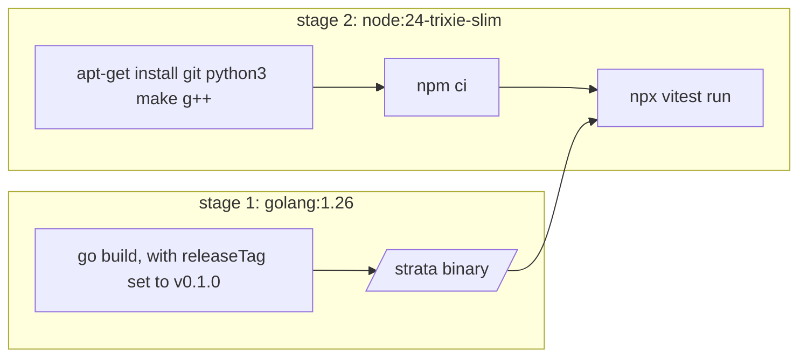

# How the end-to-end tests work

The end-to-end tests run the strata binary in a terminal, press keys, and read the screen. They find faults
that the Go tests cannot find: the real terminal output, real git, files on disk, and exit codes.

The tests are in `e2e/`. `e2e/testUtils.ts` has the helpers, and `e2e/tests/` has the tests.

## Parts

| Part | Job |
| --- | --- |
| vitest | Finds and runs the tests in `e2e/tests/`. |
| tuistory | Starts a program in a pseudo-terminal, sends keys to it, and gives its screen as text. |
| node-pty | Makes the pseudo-terminal for tuistory. |
| ghostty-opentui | The terminal emulator in tuistory. It turns the output of strata into a screen of text. |
| `testUtils.ts` | Makes throwaway git repositories, starts strata, and deletes the repositories after each test. |



## The steps of a screen test

Each screen test makes its own repository, starts strata on it, and then sends keys and reads the screen.
The test waits for text on the screen, not for a fixed time, because strata loads data in the background.



This is the same test in code:

```ts
it('j moves to the next file and shows its diff', async () => {
  const strata = await openStrata(ordersRepo().dir)
  await strata.waitForText('Branch · orders-handler')

  await strata.press('enter')
  await strata.press('j')

  const screen = await strata.waitForText('orders/handler_test.go · 2/2')
  expect(screen).toContain('func TestHandler')
})
```

## The fixture repository

`Repo.create()` makes a bare repository with the name `origin.git` and a clone with the name `repo`. The
clone pushes one commit, so `origin/main` exists and strata has a trunk.

Each git command in the helpers sets these values, so the tests do not depend on the git settings of the
machine:

- the name and email of the author and the committer
- `commit.gpgsign=false`
- `core.hooksPath=/dev/null`
- `init.defaultBranch=main`

`ordersRepo()` makes the stack that most tests use:

```
origin/main
├─ billing
└─ orders-events            gets a fix after orders-handler starts
   └─ orders-handler        checked out
      └─ orders-api         changes orders/handler.go again
```

## Plain commands and screen tests

Two helpers start strata:

| Helper | Use for | How it works |
| --- | --- | --- |
| `runStrata(cwd, args, env)` | Commands that print and stop, such as `--list`, `version` and `update` | Starts strata as a child process with pipes. It gives stdout, stderr and the exit status. |
| `openStrata(cwd, args, env)` | The screen | Starts `sh -c 'printf "\033[20l"; <env> <strata> <args>; echo "EXIT:$?"'` in a pseudo-terminal. When strata stops, the shell writes its exit status on the screen, so a test can wait for `EXIT:0`. [New line mode](#new-line-mode) tells why the command starts with `printf`. |

Both helpers set `XDG_CONFIG_HOME` to an empty directory, so strata does not read the config file of the
person who runs the tests. A test that needs a config file gives its own `XDG_CONFIG_HOME` in `env`.

`runStrata` does not block. The update tests run a fake server in the test process, and that server must
answer while strata waits for it.

## New line mode

The emulator in tuistory starts in new line mode. In that mode, a line feed moves the cursor to the next
line and also back to column 1. A real terminal starts with the mode off, so a line feed keeps the column.

Bubble Tea v2 draws only the cells that change. It moves the cursor down with a line feed and expects the
column to stay the same. In new line mode, the text then goes to the wrong column, for example over the
tree lines of the Stack panel.

So `openStrata` writes `\e[20l`, which turns new line mode off, before it starts strata.

## The update tests

The update tests start a fake GitHub API in the test process and point strata at it with
`GITHUB_API_URL`. The fake release holds an archive for the platform of the test and a `checksums.txt`.
The "new binary" in the archive is a shell script, so the test can see that the update replaced the file.



Each update test runs a copy of strata in its own folder. The update replaces that copy, so the other
tests keep the original binary.

## The sync tests

The sync tests need two more things from the fixture repository:

- **A new trunk:** `repo.commitOnOrigin(path, content, message)` makes a commit on `main` in a second clone
  and pushes it. The repository of the test gets the commit only when strata fetches.
- **An old git:** `pathWithOldGit()` returns a `PATH` with a folder first. That folder holds a `git` script
  that prints `git version 2.43.0` for `git version` and runs the real git for all other commands. A test
  gives it to strata as `runStrata(dir, args, { PATH: pathWithOldGit() })` or
  `openStrata(dir, [], { PATH: pathWithOldGit() })`, and strata then hides `strata sync` and the `S` key.

## Where the tests run

| Command | Where | What it needs |
| --- | --- | --- |
| `task test:e2e` | Docker | Docker. CI runs this command. |
| `task test:e2e:local` | This machine | Node, and git 2.44 or later, because the sync tests run `git replay` |

Both commands build strata with the tag in `E2E_TAG` in `Taskfile.yml`, which is `v0.1.0`. They set two
environment variables for the tests: `EXECUTABLE`, the path of strata, and `BUILD_TAG`, the tag. The
`version` and `update` tests compare the output of strata with `BUILD_TAG`.

The Docker image has two stages:



The second stage uses Debian trixie, which has git 2.47. strata needs git 2.41 or later, `strata sync`
needs git 2.44 or later, and Debian bookworm has git 2.39. `python3`, `make` and `g++` let npm build
node-pty when no prebuilt node-pty fits the platform.

In GitHub Actions, the `e2e` job in `.github/workflows/ci.yml` runs `task test:e2e` on `ubuntu-latest`,
which has Docker. The release workflow calls the CI workflow, so a release waits for these tests too.

## How to write a new test

1. Make a repository with `Repo.create()` or `ordersRepo()`.
2. Start strata with `openStrata(repo.dir)`.
3. Wait for text that shows that the screen is ready, for example `Branch · orders-handler`.
4. Send keys with `press`. Use `type` for text and for capital letters, because the key names in tuistory
   have lower case letters only.
5. Wait for the text that proves the result. Then check the rest of the screen with `expect`.

Keep these rules:

- **Wait for the text that you check, not for a title:** strata loads each diff in the background, so a
  title can show before its diff.
- **Give each test its own repository:** `scratchDir()` makes the folder, and `onTestFinished` deletes it.
- **Do not change the terminal size:** `openStrata` uses 160 columns and 40 rows, and the tests expect
  text that fits that size.

## Watch strata by hand in tmux

The tests do not use tmux. To look at the screen by hand, run strata in a private tmux server.

```sh
tmux -L strata-check new-session -d -s t -x 160 -y 40 -c /path/to/repo strata
tmux -L strata-check send-keys -t t Enter
tmux -L strata-check capture-pane -p -t t     # print the screen as text
tmux -L strata-check kill-server
```

`-L` starts a separate tmux server, so your own tmux sessions do not change. `capture-pane -e` also prints
the colour codes.
