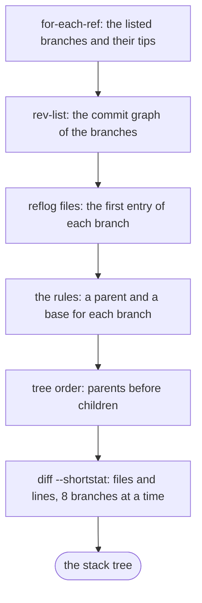
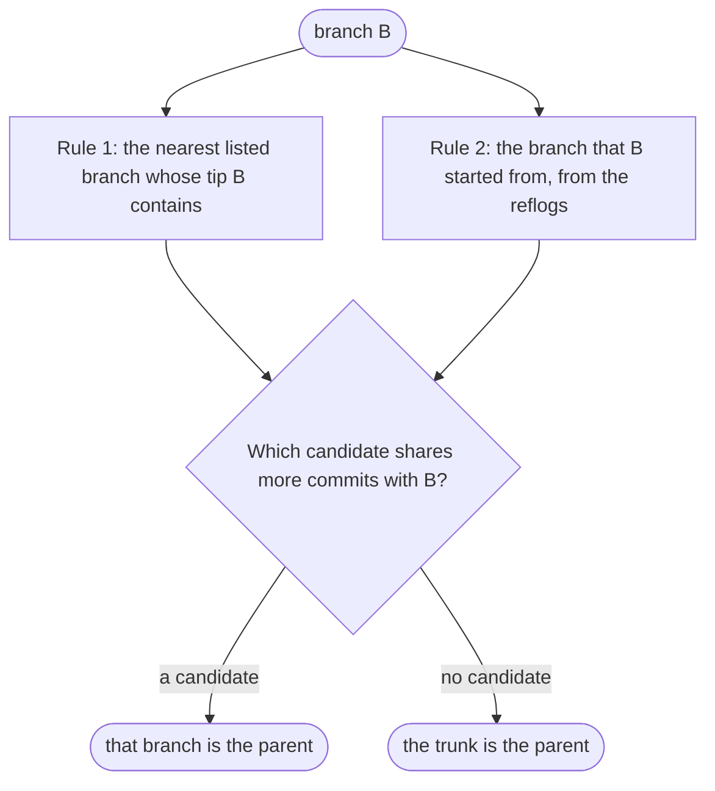
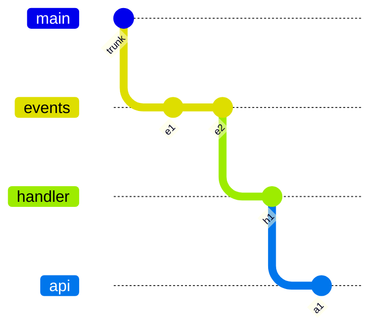
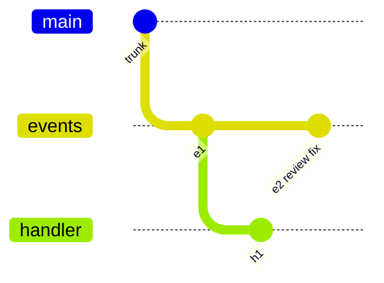

# How strata finds the stack

strata shows each branch against the branch it sits on, not against the trunk. This page tells how strata
finds that parent branch, where the diff of each branch starts, and where the counts in the tree come
from.

The code is in `internal/stack`. `reader.go` reads git, `graph.go` holds the commit graph, and
`parents.go` has the rules.

## Terms

| Term | Meaning |
| --- | --- |
| trunk | The branch that stacks start from. strata uses the first of `origin/HEAD`, `origin/main`, `origin/master`, `main` and `master` that exists. `--trunk` sets a different trunk. |
| listed branch | A branch that matches the patterns (`refs/heads/` by default) and has commits that the trunk does not have. |
| parent | The branch that a branch sits on, or the trunk. |
| base | The commit where the changes of a branch start. The diff of a branch is `git diff <base> <branch>`. |
| depth | The number of commits between the trunk and a commit. |

## The data that strata reads

strata keeps the number of git processes low. On a developer machine, one git process can cost 40 to 100
milliseconds. One read of the stack uses these sources:

| Step | Source | What strata gets |
| --- | --- | --- |
| 1 | `git for-each-ref --no-merged <trunk>` with `%(ahead-behind:<trunk>)` | The listed branches, their tips, and the number of trunk commits that each branch does not have |
| 2 | `git rev-list --parents <tips> --not <trunk>` | Each commit that the listed branches have and the trunk does not have, with its parents |
| 3 | `git rev-parse --git-common-dir` | The folder that holds the reflogs |
| 4 | `.git/logs/refs/heads/<branch>` | The reflog of each branch, read as a file |
| 5 | `.git/logs/HEAD` and `.git/worktrees/*/logs/HEAD` | The HEAD reflog of each worktree, read as files |
| 6 | `git diff --shortstat -M <base> <tip>` | The files and lines that each branch changes, for 8 branches at a time |

Steps 1 to 3 run one after the other. Steps 4 and 5 do not start a process. Step 6 runs when strata knows
the base of each branch.



## The commit graph

Step 2 gives the commits that the branches have and the trunk does not have. strata keeps these commits
in memory as a graph. The graph is small: for 26 branches in a large repository, it holds about 140
commits.

From the graph, strata gets these facts with no more git processes:

- **Reach:** the commits in the history of a commit, inside the graph.
- **Depth of a tip:** the number of commits that the tip reaches.
- **Contains:** branch B contains branch A when B reaches the tip of A.
- **Merge base:** the newest commit that two branches share, and the number of commits that they share.
- **Fork point:** the trunk commit where the history of a branch starts.

## How strata chooses the parent

strata gets up to two candidates for the parent of a branch, one from each rule. The candidate that
shares more commits with the branch is the parent. With no candidate, the parent is the trunk.



### Rule 1: the nearest branch whose tip the branch contains

When branch B contains the tip of listed branch A, A is a candidate. When B contains the tips of more than
one branch, strata takes the branch with the largest depth, which is the nearest branch. The base of B is
then the tip of that branch.

This rule works for a stack that a tool keeps up to date with rebases:



```
origin/main
└─ events        2 commits
   └─ handler    1 commit
      └─ api     1 commit
```

Rule 1 ignores two kinds of branch:

- **A branch with the same tip as B:** each of the two branches contains the tip of the other, so the rule
  cannot tell which one is the parent.
- **A branch that started from B, as the reflogs show:** an example follows in
  [An empty branch](#an-empty-branch).

### Rule 2: the branch that the branch started from

Rule 1 fails when the parent gets new commits after the child starts, for example a fix after a review.
The child does not contain the new tip of the parent.



Here, handler contains no listed tip, so rule 1 gives no candidate. With the trunk as its parent, the diff
of handler also shows e1. Rule 2 finds events from the reflogs.

The first entry in the reflog of a branch records how the branch started. strata reads that entry in one
of three ways:

| First entry of the reflog | How strata finds the branch that B started from | Commands that write the entry |
| --- | --- | --- |
| `branch: Created from events` | The entry names the branch. | `git branch handler events`, `git switch -c handler events` |
| `branch: Created from HEAD` | strata looks in the HEAD reflogs for `checkout: moving from events to handler`, at most 2 seconds from the creation. When it finds no such entry, strata uses the way in the next row. | `git switch -c handler`, `git checkout -b handler` |
| `branch: Created from 5f2c1ab…` | strata finds the listed branches that had that commit as their tip at some time. Their reflogs record each tip. | `git worktree add -b handler <path> <commit>`, which tools such as workmux use |

A named branch that is not listed, for example `origin/main`, gives no candidate by name. strata then
looks for the branches that had the commit of the first entry as their tip.

For each candidate, strata finds the merge base with B and the number of commits that they share. The
candidate that shares the most commits is the candidate of rule 2, and its merge base is the base of B.

In the example, handler started from events at e1. The merge base is e1, so the diff of handler shows h1
only. The tree shows `1 behind parent`, because events has e2 and handler does not:

```
origin/main
└─ events        2 commits
   └─ handler    1 commit   1 behind parent
```

### Which rule wins

The candidate that shares more commits with B wins, and rule 1 wins a tie. A candidate that shares no
commit beyond the trunk does not count. The comparison gives the correct parent in both of these cases:

- **The parent got new commits:** rule 1 finds only a branch lower in the stack. Rule 2 finds the real
  parent, which shares more commits.
- **The branch moved to a different parent with `git rebase`:** the reflog still names the first parent.
  Rule 1 finds the new parent, which contains the first parent and so shares more commits.

### An empty branch

An empty branch shows why rule 1 ignores a branch that started from B.

1. `git branch empty parent` makes `empty` point at the tip of `parent`.
2. `parent` gets a new commit.
3. `parent` now contains the tip of `empty`, and `empty` has the larger depth of the two candidates for
   `parent`.

Without the exception, rule 1 puts `parent` on `empty`. With the exception, `parent` keeps its own
parent, and rule 2 puts `empty` on `parent`, with 0 commits and `1 behind parent`.

## Base, counts and tree order

| Value | How strata gets it |
| --- | --- |
| Base | From rule 1: the tip of the parent. From rule 2: the merge base with the parent. On the trunk: the fork point, or `git merge-base` when the history of the branch starts at more than one trunk commit. |
| Commits | The commits that the tip reaches and the base does not reach. |
| Behind | Under a parent branch: the commits that the parent reaches and the branch does not reach. On the trunk: the second number of `%(ahead-behind:<trunk>)`. |
| Files, insertions and deletions | `git diff --shortstat -M <base> <tip>` |

strata lists the branches depth first: each parent comes before its children, and the children of one
parent come in name order. When the rules put branches in a loop, strata shows those branches at the top
level, so each branch shows.

## Limits

- **Remote branches:** a remote branch has no reflog entry for its creation, so `--remote` uses rule 1
  only. When the parent of a remote branch gets new commits, the branch sits lower in the stack, and its
  diff includes commits of the parent.
- **Old branches:** by default, git deletes reflog entries after 90 days (`gc.reflogExpire`). A branch that
  is older than that loses its first entry, so rule 2 cannot help it.
- **The reftable backend:** a repository that stores its refs in reftable has no reflog files, so strata
  uses rule 1 only.
- **Squash merges:** a branch that GitHub merged with a squash still has commits that the trunk does not
  have, so strata lists it.
- **git version:** strata needs git 2.41 or later for `%(ahead-behind:...)`.
