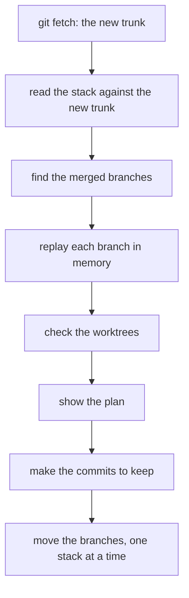
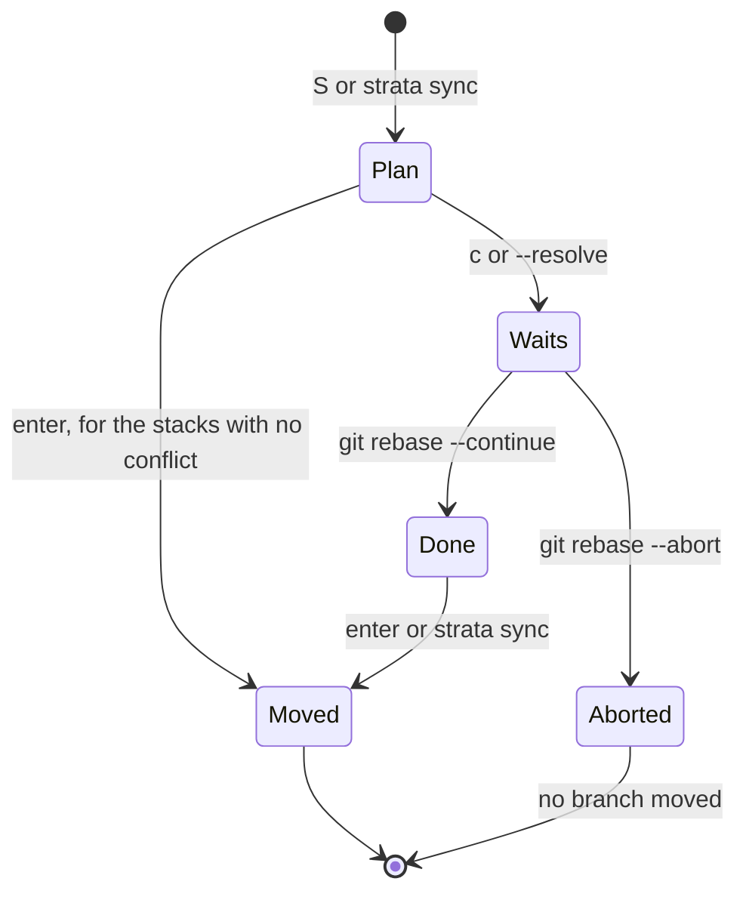

# How strata sync moves the stacks

`strata sync` gets the new trunk from the remote and moves each stack of local branches onto it. Each stack
keeps its shape. A stack with a conflict stays where it is until you resolve the conflict with `git rebase`.

This page uses the terms of [docs/stack.md](stack.md): trunk, parent, base and tip. The code is in
`internal/restack`.

## Terms

| Term | Meaning |
| --- | --- |
| stack | A branch on the trunk and all the branches that sit on it, at all levels. |
| move | Point a branch at new commits: its own commits, replayed on the new tip of its parent. |
| replay | Make a new commit with the change and the message of an old commit, on a different parent. |
| new tip | The commit that a branch points at after it moves. |
| merged branch | A branch whose changes the trunk has, for example after a squash merge on GitHub. |
| plan | For each branch: its new parent, its new tip, and the outcome. |
| sync worktree | A worktree at `.git/strata/sync/worktree`. strata adds it for a sync rebase and removes it after. |
| sync rebase | A `git rebase` in the sync worktree, with a todo list that strata writes. |

## Use

### Command line

```sh
strata sync                     # fetch the trunk and move each stack that has no conflict
strata sync --dry-run           # print the plan and change nothing
strata sync --resolve <branch>  # start a sync rebase for the stack of <branch>
strata sync --keep-merged       # do not delete the merged branches
```

`strata sync` takes the patterns and the `--trunk` flag of `strata`. `--remote` does not work with a sync,
because the branches of a teammate are not yours to move.

strata prints the plan in the layout of `strata --list`, with the outcome of each branch:

```
origin/main  3 new commits
├─ billing-invoice    merged: strata deletes it
│  └─ billing-pdf     moves onto origin/main
└─ orders-events      stays: orders-handler cannot move
   └─ orders-handler  stays: conflict in orders/order.go
      └─ orders-api   stays: orders-handler cannot move

Moved 1 stack.
```

The exit status is 1 when a stack stays because of a conflict, or when a stack did not move.

### Terminal UI

| Key | Where | Action |
| --- | --- | --- |
| `S` | Anywhere | Get the trunk from the remote and show the plan in the Stack panel. No branch moves yet. |
| `enter` | The plan | Move each stack that has no conflict. |
| `c` | The plan, on a branch of a stack with a conflict | Start a sync rebase for that stack and open your shell in the sync worktree. |
| `esc` | The plan | Close the plan and change nothing. |

The footer shows how many stacks `enter` moves, for example `enter move 2 stacks`.

The terminal UI gets the trunk with no terminal for git. A fetch that needs a password therefore fails and
shows the git error in the status line. strata does not ask for the password, because the question would
write over the screen. Run `strata sync` on the command line when git must ask.

## The steps of a sync



1. **Fetch:** strata runs `git fetch --prune` for the remote of the trunk, for example `origin` for
   `origin/main`. With a local trunk such as `main`, strata does not fetch.
2. **Read:** strata reads the stack against the new trunk, as [docs/stack.md](stack.md) tells.
3. **Merged branches:** strata runs `git merge-tree --write-tree <trunk> <branch>` for each branch on the
   trunk. When the result is the tree of the trunk, the trunk has all the changes of the branch.
4. **Replay:** strata runs `git replay --onto <new tip of parent> <base>..<branch>` for each branch that
   moves, in tree order. `git replay` changes no worktree and no branch. The replay takes the commits that
   strata shows for the branch.
5. **Worktrees:** strata checks each worktree that has a branch of the stack. [Worktrees](#worktrees) tells
   how.
6. **Commits to keep:** strata keeps the commits of the replay. When you sign commits, it makes them again
   with a sync rebase. [Signed commits](#signed-commits) tells why.
7. **Move:** for each stack, strata runs the checks of step 5 again. Then it moves the branches and deletes
   the merged branches in one `git update-ref --stdin` transaction, with the old tip of each branch. A
   branch that a worktree has checked out moves with `git reset --keep` in that worktree.

`--dry-run` stops after step 5.

## Outcomes

| Outcome in the plan | When | What strata does |
| --- | --- | --- |
| `up to date` | The branch is on the tip of its parent, and its parent does not move. | Nothing. |
| `moves onto <parent>` | The replay has no conflict. | Moves the branch with its stack. |
| `moves onto <parent>, checked out in <worktree>` | As above, and a worktree has the branch checked out. | Moves the branch, the index and the files of that worktree. |
| `merged: strata deletes it` | The trunk has all the changes of the branch. | Deletes the branch and its settings. Its children go onto the trunk. |
| `merged: strata keeps it` | As above, with `--keep-merged`. | Keeps the branch. Its children go onto the trunk. |
| `merged, checked out in <worktree>` | As above, and a worktree has the branch checked out. | Keeps the branch. Its children go onto the trunk. |
| `stays: conflict in <files>` | The replay stops. | Nothing. `c` or `--resolve` starts a sync rebase. |
| `stays: merge commit` | The branch has a merge commit in its own commits. | Nothing. |
| `stays: a rebase in <worktree> uses it` | A rebase in a worktree uses the branch now. | Nothing. |
| `stays: its worktree <worktree> is not there; run git worktree prune if you deleted it` | git has a worktree for the branch, but its folder is gone. | Nothing. |
| `stays: changes in <worktree>: <files>` | Uncommitted changes in that worktree touch files that the move changes. | Nothing. |
| `stays: it changed in <worktree>` | The worktree is not on the tip that strata read. | Nothing. |
| `stays: its parents form a loop` | strata cannot find the parent of the branch. | Nothing. |
| `stays: <branch> cannot move` | Another branch of the stack stays. | Nothing. |

`; remote branch gone, not merged` follows an outcome when the remote deleted the branch but the trunk does
not have all its changes. A closed pull request also deletes the remote branch, so strata moves such a branch
as usual.

## A stack moves as one

strata does not keep a record of parents. It finds each parent from the commits and the reflogs. When a
stack moves in part, those rules fail.

Example: `orders-events` moves and `orders-handler` stays.

- The new commits of `orders-events` and the old commits of `orders-handler` have no commit in common after
  the trunk.
- strata then shows `orders-handler` on the trunk, and its diff shows the old commits of `orders-events`.

So when one branch of a stack stays, all the branches of that stack stay. The other stacks move.

## Merged branches

When GitHub squash merges a branch, the trunk gets one new commit with all the changes of the branch. The
commits of the branch are not in the trunk, so strata still lists the branch.

The children of a merged branch replay only their own commits onto the trunk. A rebase of the child onto the
trunk replays the commits of the merged branch too, and those commits stop with a conflict.

strata deletes a merged branch in the same transaction as the other branches of its stack. It also removes
the settings of the branch, `branch.<name>` in the git config. strata does not delete a merged branch that a
worktree has checked out.

## Conflicts

A conflict stops only the stack that has it. To resolve the conflict:

1. Start a sync rebase: press `c` on a branch of the stack, or run `strata sync --resolve <branch>`. The
   rebase stops at the conflict, in the sync worktree. strata does not pick a side for you.
2. Resolve the conflict in the sync worktree with git, as in any rebase: edit the files or run
   `git mergetool`, then `git add` and `git rebase --continue`.
3. Move the resolved stack:
   - **Terminal UI:** exit the shell. The Stack panel shows the plan of the resolved stack, and `enter` moves
     it.
   - **Command line:** run `strata sync`. It moves the resolved stack, then it syncs the other stacks.

   Both moves use the checks and the transaction of any move.

`git rebase --abort` ends the sync rebase, and no branch moves.

strata keeps a record of the sync rebase in `.git/strata/sync/plan`: the branches of the stack, their old
tips and their worktrees. The rebase writes the new tip of each branch to `refs/strata/sync/<branch>`.
strata reads these to find the state of the sync rebase:

| State | What strata does |
| --- | --- |
| The rebase waits | `S`, `enter`, `strata sync` and `strata sync --resolve` tell you to finish the rebase first, and move nothing. |
| The rebase is done | `S` shows the plan of the resolved stack, and `enter` moves it. `strata sync` moves it. |
| You aborted the rebase | strata removes the record, the sync worktree and the refs. No branch moved. |



One strata at a time can use the sync worktree. While strata starts a sync rebase, moves a resolved stack
or signs the commits of a sync, it locks `.git/strata/sync/lock`. Another strata that tries one of these
moves nothing and shows this error:

```
another strata runs a sync rebase in this repository now: try again when it ends
```

## Worktrees

A stack often has its branches checked out in their own worktrees, for example with workmux. strata keeps
those worktrees correct with three rules:

1. **A branch in a worktree moves with `git reset --keep` in that worktree.** The branch, the index and the
   files move together. Uncommitted changes in other files stay. A move of the ref alone leaves the
   worktree with staged changes that undo the move.
2. **strata does not move a branch that a rebase uses.** During a rebase, the worktree has a detached HEAD.
   strata reads `rebase-merge/head-name` and `rebase-apply/head-name` in `.git` and in `.git/worktrees/*` to
   find the branch.
3. **strata does not move a branch when uncommitted changes in its worktree touch files that the move
   changes.** strata compares `git status` of the worktree with the files that differ between the old tip
   and the new tip.

strata runs these checks when it plans and again just before a stack moves. When `git reset --keep` fails
in a worktree after the other branches of the stack moved, strata keeps the new tip in
`refs/strata/sync/<branch>` and prints the command that finishes the move:

```sh
git -C <worktree> reset --keep refs/strata/sync/<branch>
```

strata cannot know when a program in a worktree edits files and has no commit yet. The plan names each
worktree that the sync changes, so you can decide.

## Signed commits

`git replay` does not sign commits. When `commit.gpgsign` is true, strata makes the commits to keep again
with a sync rebase, which signs each commit with your settings. The sync rebase runs in the sync worktree,
with the hooks of the repository off, and moves no branch. strata then moves the branches to the signed
commits, as in step 7. When you press Ctrl+C during the sync rebase, strata ends it, and no branch moves.

## Git version

The plan uses `git replay`, which is in git 2.44 and later. On an older git, strata does not show the sync:

- `strata --help` does not list `sync`.
- The keys screen and the footer do not show `S`.
- `strata sync` and `S` show this error:

  ```
  sync needs git 2.44 or later, and this is git 2.43.0
  ```

## Limits

- **Push:** after a sync, each branch that moved needs `git push --force-with-lease`.
- **Merge commits:** a stack stays when a branch has a merge commit in its own commits.
- **Empty commits:** a commit whose change the trunk has already stays, as an empty commit.
  `git rebase -i` can drop it.
- **The files of a conflict:** strata names the files from one merge of the full branch, so the sync rebase
  can stop on a commit that changes fewer of them.
- **Signatures:** a sync rebase signs each commit. A program for signatures that asks for each signature asks
  one time for each commit.
- **Large repositories:** the sync worktree is a full checkout. When you sign commits, each sync that moves a
  branch adds one.
